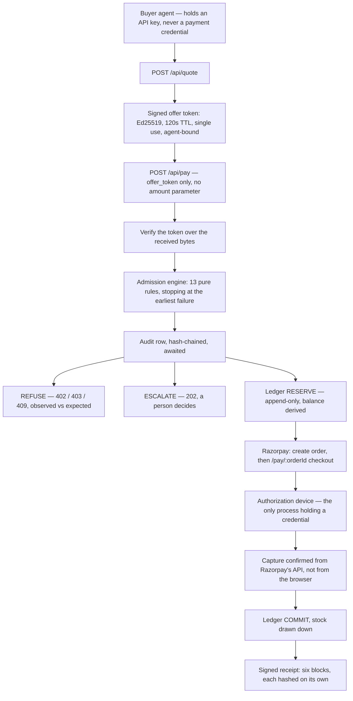
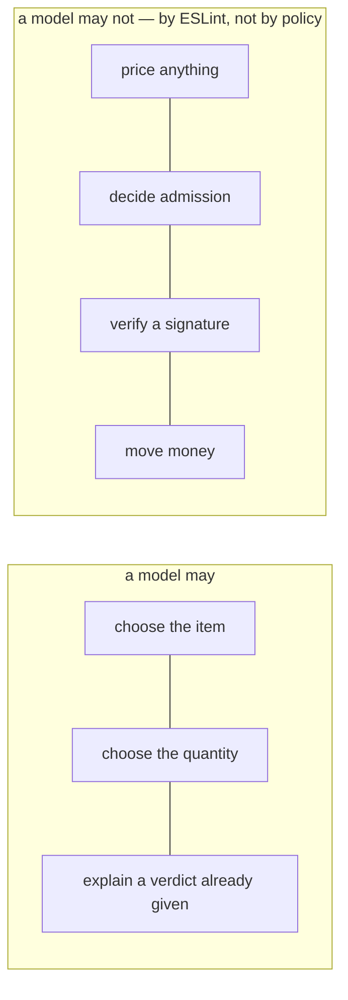
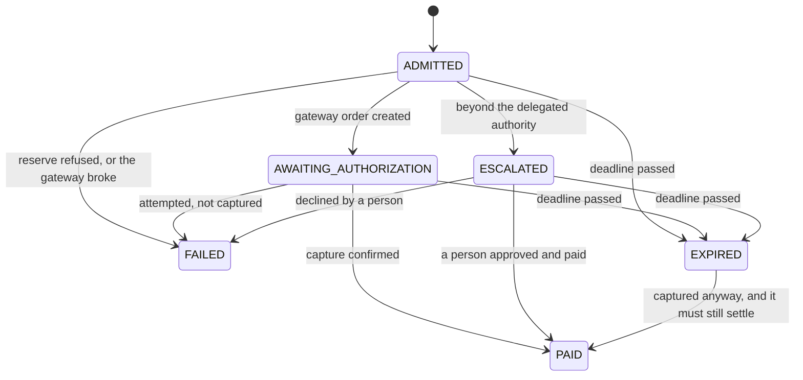

# Architecture

Vouch is a merchant-side **admission and evidence** layer for AI buyers. This document is the map:
what talks to what, which states a payment can be in, where money is derived rather than stored,
and — the part the build was actually designed around — **exactly where a language model is allowed
to be**.

The one-line version: *the merchant owns and evidences the risk decision; Razorpay is the
beneficiary of the evidence, never the underwriter of the decision.*

---

## 1. The whole path, once


The same path as source, so it can be diffed rather than redrawn:



**The order of operations in `src/core/orders/pay.ts` is the security property:**

> resume → verify → decide → **audit** → record decision → hold → gateway

The audit row is `await`ed before anything is held or charged. The gateway is touched last, so an
outage cannot leave a charge with no reservation behind it — and when it does fail, the hold is
released and both facts are written down.

`pay()` never itself moves money. It admits, holds, and hands back a URL.

---

## 2. Where a model is allowed, and where it is refused

This is the table the build exists to be able to write. Every "no" is enforced by something other
than good intentions.

| Step | Model? | What enforces it |
|---|---|---|
| Deciding what to buy, and how many | **Yes** | The buyer agent, `src/agent/buyer.ts`. It reads a catalogue and a need written in prose |
| Writing the errand a shelf raises | No | Composed from the shortfall — `askFor()` in `src/demo/ops.ts` |
| Pricing | **No** | The merchant signs the price. `pay` has no `amount` parameter, so there is nothing for a model to state |
| **Admitting or refusing a payment** | **No, and it cannot be** | `src/core/engine/engine.ts` is pure, synchronous, zero I/O. ESLint forbids it importing `postgres`, `drizzle-orm`, the db module, or **`node:crypto`** |
| Verifying a signature | No | `node:crypto` Ed25519, over the received bytes |
| Moving money | No | The authorization device is the only process holding a card |
| Building a receipt | No | `src/core/receipts/build.ts` — deterministic, canonical JSON |
| Explaining a decision after the fact | **Yes, and only here** | Prose over a verdict already reached |

Banning `node:crypto` from the engine is the load-bearing one. It forces *"the signature was valid"*
to arrive as a **boolean on the context** rather than as something the engine computes — which is
what makes the engine testable with no database and no keys, and why 210 decisions in
`npm run harness` cost no network at all.

The agent is held at arm's length by the same mechanism: `src/agent/**` may not import `@/core`.
**Enforcement an agent can bypass is not enforcement** — the buyer reaches the merchant over HTTP or
MCP exactly as a third party's would.



### The proof, not the promise

The slogan *"AI proposes, deterministic rules decide"* is easy to write. The difference here is that
the boundary is **falsifiable**:

- `npm run harness` — 14 labelled violation classes x 15 attempts = **210 decisions, 210 classified
  exactly**, driving `evaluate()` directly. Zero gateway calls, zero model calls, by construction.
- `npm run demo:2` — a real model, given a goal it cannot reach honestly and two ordinary optional
  API parameters it could lie through. Nothing instructs it to lie; the bait is merchant marketing
  copy it reads as product data. When it invents a discount, the refusal and **its own words** are
  stored, and shown at `/misquotes`.

---

## 3. Order states



`src/core/orders/state.ts` is the only place a state changes, and the map above is the whole of it.
An illegal transition is impossible to write by accident, and a replayed webhook cannot walk a
settled order backwards.

`EXPIRED -> PAID` is deliberate. A capture can land after the deadline; if `PAID` were unreachable
from `EXPIRED`, settlement would bail and leave money taken at Razorpay with no COMMIT and no
receipt.

---

## 4. Money

Four rules, each structural rather than a convention someone has to remember.

| Rule | How |
|---|---|
| Money is `bigint` **paise**. No float ever touches it | SQL aggregates cast `::text` and are re-parsed with `BigInt()`, so the driver cannot round one |
| **Balances are derived, never stored** | `available = max - COMMIT - (RESERVE - COMMIT - RELEASE)`, in `src/core/ledger.ts`. A stored balance drifts under concurrency |
| Every state change is a new row | The ledger is append-only. Corrections are new rows, never edits |
| Every money write is idempotent | With a DB unique index as the backstop, not the code that checks — `unique(reservation_id, entry_type)` is what makes a double COMMIT impossible |

**Stock leaves at settlement, never at admission** — a hold that never settles must not consume
inventory. The two counts are shown separately: units *promised*, and units *on hand*.

Gate numbers and settlement numbers live in different tables and are **never added together**. One
measures decisions made with no network; the other measures money that actually moved.

---

## 5. The receipt

Six blocks, each hashed on its own, so a tamper report names the block rather than the file.

| Block | The question it answers |
|---|---|
| `authorization` | Who delegated this authority, and when? |
| `policy` | What rules were in force at the moment of the decision? |
| `offer` | What price did the merchant actually sign? |
| `decision` | Did the agent stay inside its authority? |
| `payment` | Did the money move, and against which bytes? |
| `audit` | Where does this sit in the tamper-evident chain? |

The bundle carries the public key, so a third party verifies it with **no database, no keys and no
network** — `npm run receipt verify <file>`. A receipt is re-verified **on every view**, never
trusted from storage: a receipt nobody re-checks is a stored assertion, not evidence.

The `decision` block is deliberately not filtered to `ADMIT`. An escalated order that a human paid
carries an `ESCALATE` decision, and that is precisely what its receipt has to show — the agent was
refused, and a person overrode it.

---

## 6. Two Razorpay realities that shaped the design

**Nothing completes a payment headlessly on a plain test key.** S2S is support- and PCI-gated, and
UPI Collect was deprecated on 2026-02-28. So the merchant creates an order, and a separate
credential-holding process — the **authorization device** — completes it. That is not a workaround,
it is the architecture: the agent is handed a URL and never a credential, which mirrors Reserve Pay
exactly, and is why `pay()` itself never moves money.

**UPI Reserve Pay is activation-gated and unavailable in test mode.** Razorpay support confirmed
this in writing on 2026-08-30, ticket #20607038. It is therefore **not integrated here, and nothing
in this repo claims it is.** What the `authorizations` table does carry is Razorpay's own Reserve Pay
vocabulary — `token_type` defaulting to `single_block_multiple_debit`, `frequency` to
`as_presented`, alongside `max_amount_paise` and `expire_at` — so the authorization model means the
same thing on both sides and no mandate format is invented.

---

## 7. Layout

```
src/core/           engine, ledger, orders, offers, receipts, audit, db
src/agent/          the buyer agent. May not import @/core
src/app/api/        routing only, 12-line ceiling
src/app/(console)/  the operator's console
src/mcp/            the same four functions over stdio
src/demo/           the live floor and the gate harness. Under no boundary
```

Business logic is plain framework-free async functions taking typed objects and returning typed
objects — never a `Response`, never an MCP content block. That is what lets an HTTP route, the MCP
server, a webhook and a script all share one implementation.
