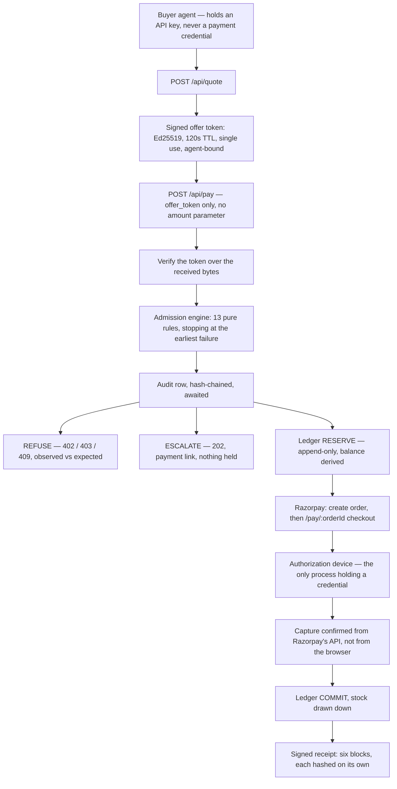

# Vouch

A merchant-side **admission and evidence** layer for AI buyers.
Razorpay AI Buildathon, Track 01. Solo build.

> The merchant publishes signed offers. An AI buyer transacts against a Reserve-Pay-shaped
> authorization. A deterministic engine decides **ADMIT / ESCALATE / REFUSE** per transaction.
> Every order emits a **dispute-grade receipt** proving who delegated authority, when, with what
> scope, what parameters were set, and whether the agent stayed inside them.

**The receipt is the product.** Everyone builds a guard; almost nobody builds the proof.

The positioning that decides every design call: *the merchant owns and evidences the risk decision;
Razorpay is the beneficiary of the evidence, never the underwriter of the decision.*

---

## How it works



Order of operations in `src/core/orders/pay.ts` is the security property:
**resume → verify → decide → audit → record decision → hold → gateway.**
The audit row is `await`ed before anything is held or charged. The gateway is touched last, so a
gateway outage cannot leave a charge with no reservation behind it — and when it fails, the hold is
released and both facts are written down.

`pay()` never itself moves money. It admits, holds, and hands back a URL.

## The decision

Pure, synchronous, zero I/O (`src/core/engine/engine.ts`). The clock arrives as `ctx.now` and
"the offer signature was valid" arrives as a boolean, because the engine may not import
`node:crypto` or the database. That is what makes determinism testable with no DB and no keys.

| Outcome | HTTP | Meaning |
|---|---|---|
| `ADMIT` | 201 | Inside the mandate. Money is held, the order awaits authorization |
| `ESCALATE` | **202** | Legitimate, but beyond what *this agent* was delegated. A human can complete it. Not an error, and nothing is held |
| `REFUSE` | 402 / 403 / 409 | Machine-readable code plus `observed` / `expected`, so the agent can act on it |

Thirteen rules, walked top-down, stopping at the earliest failure (`src/core/engine/rules.ts`):

| # | Rule | Code on failure | Outcome |
|---|---|---|---|
| 1 | `agent.status` | `AGENT_FROZEN` | REFUSE |
| 2 | `offer.signature` | `OFFER_SIGNATURE_INVALID` | REFUSE |
| 3 | `offer.expiry` | `OFFER_EXPIRED` | REFUSE |
| 4 | `offer.agentBinding` | `OFFER_WRONG_AGENT` | REFUSE |
| 5 | `offer.singleUse` | `OFFER_ALREADY_USED` | REFUSE |
| 6 | `offer.claimedTotal` | `MISQUOTE` | REFUSE |
| 7 | `authorization.status` | `AUTHORIZATION_NOT_CONFIRMED` | REFUSE |
| 8 | `authorization.expiry` | `AUTHORIZATION_EXPIRED` | REFUSE |
| 9 | `authorization.scope` | `SKU_NOT_AUTHORIZED` | REFUSE |
| 10 | `authorization.maxPerOrder` | `PER_ORDER_LIMIT_EXCEEDED` | **ESCALATE** |
| 11 | `authorization.available` | `AUTHORIZATION_EXCEEDED` | **ESCALATE** |
| 12 | `authorization.maxOrdersPerHour` | `VELOCITY_EXCEEDED` | REFUSE |
| 13 | `catalog.inventory` | `OUT_OF_STOCK` | REFUSE |

Rule 6 is the one worth reading twice. `pay` has no amount parameter; `claimed_total_paise` is
advisory. The server charges the merchant-signed total regardless, and a mismatch is **recorded**
as a misquote event with the agent's own words kept verbatim — not quietly corrected.

**Deny by default, three ways.** An engine that cannot reach an answer must never read as
permission:

| Path | Result |
|---|---|
| No offer on the context | `REFUSE` / `OFFER_UNKNOWN` |
| No authorization on the context | `REFUSE` / `AUTHORIZATION_UNKNOWN` |
| Any throw inside any rule | `REFUSE` / `GUARD_UNAVAILABLE` |

## The receipt

Issued when an order reaches `PAID`. Six blocks, each hashed on its own, so a tamper report can say
*"the payment block was altered"* rather than *"signature invalid"* (`src/core/receipts/build.ts`).

| Block | Answers |
|---|---|
| `authorization` | Who delegated this authority, when, how, and how far it went |
| `policy` | The policy snapshot as it was, embedded whole — a pointer is worthless in a dispute months later |
| `offer` | The merchant's own signed price, verbatim |
| `decision` | The verdict, every rule checked, and what it cost the authorization |
| `payment` | The Razorpay ids, and whether settlement was learned from a verified webhook or from polling |
| `audit` | The hash-chain range this order produced, and the head it ends at |

The body is signed with Ed25519 over canonical bytes and stored as those exact bytes. Verification
runs over the **received** bytes, never a re-serialisation — parse-then-re-serialise silently repairs
whitespace and key order, and every tamper test then passes for the wrong reason.

The exported bundle carries the public key, so a third party verifies with the file alone: no
database, no keys, no network.

```bash
npm run receipt export <orderId>              # writes evidence/receipt-<orderId>.json
npm run receipt verify <file>                 # signature + per-block hashes
npm run receipt tamper <file> <path> <value>  # change one field, watch it name the block
```

## Run it

Needs Node, a Postgres database (Supabase), and Razorpay **test-mode** keys.

```bash
npm install
cp .env.example .env.local
npm run keygen        # prints the Ed25519 signing keypair; paste the lines into .env.local
npm run db:check      # optional: tells you if the two Postgres URLs are swapped
npm run db:migrate
npm run db:seed
npm run dev
```

Environment variables, all named in `.env.example` — fill them there, never here:

| Variable | For |
|---|---|
| `RAZORPAY_KEY_ID`, `RAZORPAY_KEY_SECRET` | Test-mode API key. A key not starting `rzp_test_` is refused on load (`src/core/env.ts`) |
| `RAZORPAY_WEBHOOK_SECRET` | HMAC over the raw webhook bytes |
| `DATABASE_URL` | Pooled connection, port 6543. The app, MCP server and every script |
| `DIRECT_URL` | Direct or session-pooler connection, port 5432. Migrations only — `db:migrate` refuses to run DDL over the transaction pooler |
| `VOUCH_SIGNING_PRIVATE_KEY`, `VOUCH_SIGNING_PUBLIC_KEY`, `VOUCH_SIGNING_KEY_ID` | Offer tokens and receipts |
| `GROQ_API_KEY`, `GROQ_MODEL` | The buyer agent only. Never in the money path |
| `APP_URL` | Webhook callback target; a tunnel URL when testing webhooks |
| `VOUCH_AGENT_KEY` | The demo agent's own key, printed by `db:seed` |

The seeded mandate: ₹9,000 total, ₹11,000 per order, 10 orders/hour, categories
`peripherals` / `accessories` / `audio`. Re-seeding truncates and rebuilds, so a run always starts
from the same place.

### Demos

Each needs `npm run dev` in another terminal.

| Command | What it shows |
|---|---|
| `npm run demo:1` | An agent buys something end to end over real HTTP. Nothing stubbed |
| `npm run demo:2` | A real model is given a goal it cannot reach honestly, with two ordinary API parameters it could misstate a price through. Nothing tells it to lie; whether it tries is the measurement |
| `npm run demo:3` | The same `pay` call twice, either side of settlement. A retrying agent gets the same order and the same receipt, never a second charge |
| `npm run demo:4` | The agent is refused at the per-order cap, and a person completes the same purchase from the 202's link |
| `npm run restock` | The unattended run: six business situations, the agent finds the SKUs itself, the guard answers each. Nobody types anything after the command |
| `npm run device` | The authorization device settles everything awaiting authorization. `npm run device <orderId>` for one; `npm run device -- --fail` pays with a card this business rejects, so the hold comes back |
| `npm run receipt` | Export, verify, tamper — see above |
| `npm run harness` | 14 labelled violation classes × 15 attempts = 210 decisions, driving `evaluate()` directly. **Zero gateway calls, zero LLM calls**, by construction |
| `npm run settle` | Real settlements against Razorpay test mode |
| `npm run mcp` | The MCP stdio surface: the same four functions as the HTTP routes |

Gate numbers (`harness`) and settlement numbers (`settle`) live in different tables and are never
added together. One measures decisions with no network; the other measures money that actually moved.

The console is at `/` — `/live`, `/agent`, `/decisions`, `/authorizations`, `/receipts`,
`/misquotes`, `/metrics`.

### Tests

```bash
npm test        # vitest
npm run lint    # the boundaries below are ESLint rules
npm run typecheck
```

Pure logic — the engine, money, tokens, the state machine — is tested with no database.
DB-backed suites self-gate on `DATABASE_URL` (and where relevant the signing key or Razorpay key)
and skip cleanly when it is absent, so a clean clone runs the suite without secrets.

## Enforced boundaries

ESLint rules, in `eslint.config.mjs`. Violating one fails the build rather than the review.

| Module | Cannot import | Why |
|---|---|---|
| `src/core/engine/**` | `postgres`, `drizzle-orm`, the db module, **`node:crypto`** | Purity is testable with no DB and no keys. Banning crypto forces "the signature was valid" to arrive as a boolean on the context |
| `src/agent/**` | the entire `@/core` module | **Enforcement the agent can bypass is not enforcement.** The buyer agent reaches the merchant over HTTP or MCP exactly as a third party's would |
| `src/app/api/**`, `src/mcp/**` | the engine, the db | Both surfaces are adapters over one shared function layer, so neither can grow its own logic |
| `src/app/**/route.ts` | — | `max-lines: 12`. A long routing file means logic escaped into it |

The MCP server authenticates as the **agent**, not as the merchant — the contrast being drawn is
with a merchant-credentialed tool surface, where an agent holding those credentials can do anything
the merchant can.

## Deliberately absent

Each of these is a dependency this project decided not to take:

- **The Razorpay SDK** — plain `fetch` against four REST paths plus one HMAC check, all in one file.
- **Any JWT library** — `node:crypto` Ed25519 and a two-segment token: `base64url(canonical json)`
  `.` `base64url(signature)`. No header segment, so there is no algorithm to negotiate and no
  `alg:none` attack surface to defend.
- **A money formatter** — `Intl.NumberFormat("en-IN")`.
- **`dotenv`** — `tsx --env-file=`.
- **`date-fns`.**
- **Any UI kit or chart library.**
- **`msw`** — the drills use real HTTP.
- **A logger.**
- **x402, Algorand, or any chain package.**

## Two Razorpay realities

Both are stated plainly because both shaped the architecture.

**1. Nothing completes a payment headlessly on a plain test key.** Server-to-server is support-gated
and PCI-gated; UPI Collect was deprecated on 2026-02-28. So Vouch creates the order and hands back a
URL, and a separate credential-holding process — **the authorization device** (`scripts/device.ts`)
— completes it by driving the real Razorpay checkout.

This mirrors Reserve Pay rather than working around it: the agent never pays, and something the
human controls authorises the spend. It is why `pay()` itself never moves money.

These are **real test-mode payments**. The device captures real payment ids, and capture is
confirmed by asking Razorpay's API — never the browser that was just driven, and never the checkout
callback, which runs on a page the payer controls. `--fail` pays with an international card against
a domestic-only account, which produces a genuinely failed payment record and a released hold.

**2. UPI Reserve Pay is activation-gated, and not available in test mode at all.** Razorpay support
confirmed this in writing on 2026-08-30 (ticket #20607038). Live activation is support-gated.

So the Reserve Pay integration is **not live here**, and nothing in this repo claims otherwise. What
the `authorizations` table does carry is Razorpay's own Reserve Pay vocabulary — `token_type`
defaulting to `single_block_multiple_debit`, `frequency` to `as_presented`, alongside
`max_amount_paise` and `expire_at` — so the authorization model means the same thing on both sides
and no mandate format is invented. There is deliberately no `amount_debited` column: that is derived
from the ledger, because a stored balance drifts under concurrency.

## Money and correctness

Non-negotiables, and each is enforced somewhere you can point at:

- Money is `bigint` minor units (paise). No float ever touches a money value. SQL aggregates cast
  `::text` and re-parse, so the driver cannot round.
- **Balances are derived from an append-only ledger** — `RESERVE` holds, `COMMIT` debits, `RELEASE`
  gives back — never stored as a mutable column. A stored balance drifts under concurrency.
- Every state change writes a row. Corrections are new rows. Nothing is edited in place.
- Every money-adjacent write path is idempotent, with a DB unique index as the backstop. A webhook
  delivered twice debits once; that has a test.
- The audit log is hash-chained (`prev_hash` → `row_hash`) under a Postgres advisory lock, so the
  chain has one global row order and the receipt can commit to a range of it.
- Stock leaves when the money is taken, not when the order is placed, in a single statement floored
  at zero — a hold that never settles must not consume inventory.
- **No LLM output reaches a decision, a price, or a signature check.** The model in this repo is the
  *buyer*, on the other side of the boundary. The engine is deterministic.

## Layout

```
src/core/       framework-free async functions: engine, ledger, offers, orders, receipts, audit
src/app/api/    HTTP adapters — validate, call one function, format the envelope
src/mcp/        the same four functions, second encoding
src/agent/      the buyer agent. Cannot import core
src/app/        the merchant console and the checkout page
scripts/        probe, keygen, migrate, seed, demos, device, harness, settle, receipt
tests/          vitest; pure suites run with no database
```

Every HTTP response uses one envelope — `{ status, statusCode, data }` on success,
`{ status, statusCode, message, error: { code, details } }` on failure — built by helpers, never by
hand, so the HTTP status always comes from the error catalogue rather than the handler's memory.
