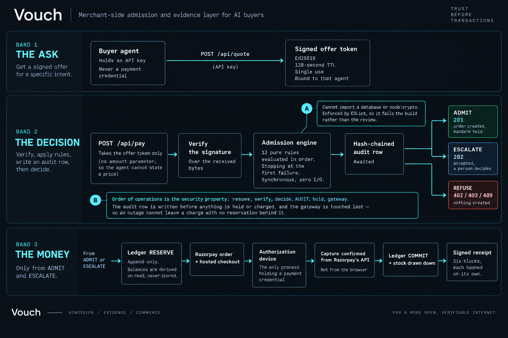
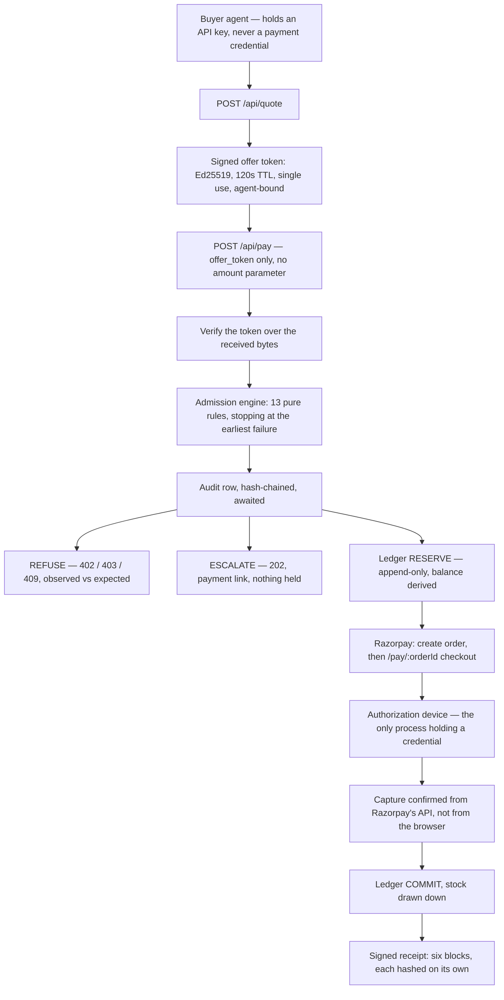

# Vouch

A merchant-side **admission and evidence** layer for AI buyers.
Razorpay AI Buildathon, Track 01. Solo build.

> The merchant publishes signed offers. An AI buyer transacts against a Reserve-Pay-shaped
> authorization. A deterministic engine decides **ADMIT / ESCALATE / REFUSE** per transaction.
> Every order emits a **dispute-grade receipt** proving who delegated authority, when, with what
> scope, what parameters were set, and whether the agent stayed inside them.

**The receipt is the product.** Everyone builds a guard; almost nobody builds the proof.

The positioning that decides every design call: *the merchant owns and evidences the risk decision;
Razorpay is the beneficiary of the evidence, never the underwriter of the decision.*

Track 01 asks for an agent that grows a merchant's revenue, **or one that makes a merchant
transactable by an AI buyer end to end**. This is the second. The track's bar — *every money action
explainable, bounded and gated; show the audit trail and one failure handled gracefully* — is taken
literally, and each half of it is a link in the table below.



---

## What is actually on the record

Every figure here is produced by a command in this repo, and each links to the page that shows it.
Gate numbers and settlement numbers are listed apart, because they answer different questions and
adding them would turn *"we decided 240 times"* into a claim about money that never moved.

**The gate** — `npm run harness`, driving `evaluate()` directly:

| | |
|---|---|
| Violation classes, 15 attempts each | **210 decisions** |
| Classified exactly as expected | **210 / 210** |
| Engine latency | **p50 4.2us, p95 22.7us** |
| Razorpay calls, model calls on this path | **zero, by construction** |

**The money** — `npm run settle` and `npm run demo:4`, against Razorpay test mode:

| | |
|---|---|
| Orders settled, with a real `pay_...` id each | **14** |
| Signed receipts, one per settled order | **14** |
| Settled value | **Rs 32,232** |
| Of which a person authorised after the agent was escalated | **4, totalling Rs 23,937** |
| Hash-chained audit rows, verified end to end | **399, chain intact** |

**The build:** 151 tests across 21 files, run against a real Postgres — no mocked database, no
mocked gateway. Four ESLint boundaries that fail the build rather than the review.

The one number here that is *not* ours is on Razorpay's own dashboard: this account has taken
**27 test-mode captures totalling Rs 54,988** across the build. That is Razorpay's ledger
independently confirming money moved, and it is deliberately not mixed with the figures above.

Four of these artifacts are committed, so none of it has to be taken on trust —
[`evidence/public/`](evidence/public/) holds the full 210-decision harness output, the settlement
run with its real payment ids, and one signed receipt beside a tampered copy of itself. The tamper
report **names the altered block**. [`ARCHITECTURE.md`](ARCHITECTURE.md) has the diagrams and the
table of exactly where a model is and is not allowed; [`FAILURES.md`](FAILURES.md) is what broke
along the way, written as it happened.

---

## How it works



Order of operations in `src/core/orders/pay.ts` is the security property:
**resume → verify → decide → audit → record decision → hold → gateway.**
The audit row is `await`ed before anything is held or charged. The gateway is touched last, so a
gateway outage cannot leave a charge with no reservation behind it — and when it fails, the hold is
released and both facts are written down.

`pay()` never itself moves money. It admits, holds, and hands back a URL.

## The decision

Pure, synchronous, zero I/O (`src/core/engine/engine.ts`). The clock arrives as `ctx.now` and
"the offer signature was valid" arrives as a boolean, because the engine may not import
`node:crypto` or the database. That is what makes determinism testable with no DB and no keys.

| Outcome | HTTP | Meaning |
|---|---|---|
| `ADMIT` | 201 | Inside the mandate. Money is held, the order awaits authorization |
| `ESCALATE` | **202** | Legitimate, but beyond what *this agent* was delegated. A human can complete it. Not an error, and nothing is held |
| `REFUSE` | 402 / 403 / 409 | Machine-readable code plus `observed` / `expected`, so the agent can act on it |

Thirteen rules, walked top-down, stopping at the earliest failure (`src/core/engine/rules.ts`):

| # | Rule | Code on failure | Outcome |
|---|---|---|---|
| 1 | `agent.status` | `AGENT_FROZEN` | REFUSE |
| 2 | `offer.signature` | `OFFER_SIGNATURE_INVALID` | REFUSE |
| 3 | `offer.expiry` | `OFFER_EXPIRED` | REFUSE |
| 4 | `offer.agentBinding` | `OFFER_WRONG_AGENT` | REFUSE |
| 5 | `offer.singleUse` | `OFFER_ALREADY_USED` | REFUSE |
| 6 | `offer.claimedTotal` | `MISQUOTE` | REFUSE |
| 7 | `authorization.status` | `AUTHORIZATION_NOT_CONFIRMED` | REFUSE |
| 8 | `authorization.expiry` | `AUTHORIZATION_EXPIRED` | REFUSE |
| 9 | `authorization.scope` | `SKU_NOT_AUTHORIZED` | REFUSE |
| 10 | `authorization.maxPerOrder` | `PER_ORDER_LIMIT_EXCEEDED` | **ESCALATE** |
| 11 | `authorization.available` | `AUTHORIZATION_EXCEEDED` | **ESCALATE** |
| 12 | `authorization.maxOrdersPerHour` | `VELOCITY_EXCEEDED` | REFUSE |
| 13 | `catalog.inventory` | `OUT_OF_STOCK` | REFUSE |

Rule 6 is the one worth reading twice. `pay` has no amount parameter; `claimed_total_paise` is
advisory. The server charges the merchant-signed total regardless, and a mismatch is **recorded**
as a misquote event with the agent's own words kept verbatim — not quietly corrected.

**Deny by default, three ways.** An engine that cannot reach an answer must never read as
permission:

| Path | Result |
|---|---|
| No offer on the context | `REFUSE` / `OFFER_UNKNOWN` |
| No authorization on the context | `REFUSE` / `AUTHORIZATION_UNKNOWN` |
| Any throw inside any rule | `REFUSE` / `GUARD_UNAVAILABLE` |

## The receipt

Issued when an order reaches `PAID`. Six blocks, each hashed on its own, so a tamper report can say
*"the payment block was altered"* rather than *"signature invalid"* (`src/core/receipts/build.ts`).

| Block | Answers |
|---|---|
| `authorization` | Who delegated this authority, when, how, and how far it went |
| `policy` | The policy snapshot as it was, embedded whole — a pointer is worthless in a dispute months later |
| `offer` | The merchant's own signed price, verbatim |
| `decision` | The verdict, every rule checked, and what it cost the authorization |
| `payment` | The Razorpay ids, and whether settlement was learned from a verified webhook or from polling |
| `audit` | The hash-chain range this order produced, and the head it ends at |

The body is signed with Ed25519 over canonical bytes and stored as those exact bytes. Verification
runs over the **received** bytes, never a re-serialisation — parse-then-re-serialise silently repairs
whitespace and key order, and every tamper test then passes for the wrong reason.

The exported bundle carries the public key, so a third party verifies with the file alone: no
database, no keys, no network.

```bash
npm run receipt export <orderId>              # writes evidence/receipt-<orderId>.json
npm run receipt verify <file>                 # signature + per-block hashes
npm run receipt tamper <file> <path> <value>  # change one field, watch it name the block
npm run receipt backfill                      # issue one for any paid order that has none
```

## Verify a receipt against this repo

Every exported bundle carries the public key, so `npm run receipt verify <file>` needs no database,
no keys and no network. If you would rather not trust the key travelling with the file, this is the
one the deployment signs with:

```
MCowBQYDK2VwAyEALw46tI6m47XZO7aBLC/xkJUw2qqgyaiZIlxFTPPGB8I=
```

Ed25519, DER/SPKI, base64. `key_id` `vouch-k1`. A bundle whose `public_key` does not match this
should not verify, and `npm run receipt verify` will say so.

## Run it

Needs Node, a Postgres database (Supabase), and Razorpay **test-mode** keys.

```bash
npm install
cp .env.example .env.local
npm run keygen        # prints the Ed25519 signing keypair; paste the lines into .env.local
npm run db:check      # optional: tells you if the two Postgres URLs are swapped
npm run db:migrate
npm run db:seed
npm run dev
```

Environment variables, all named in `.env.example` — fill them there, never here:

| Variable | For |
|---|---|
| `RAZORPAY_KEY_ID`, `RAZORPAY_KEY_SECRET` | Test-mode API key. A key not starting `rzp_test_` is refused on load (`src/core/env.ts`) |
| `RAZORPAY_WEBHOOK_SECRET` | HMAC over the raw webhook bytes |
| `DATABASE_URL` | Pooled connection, port 6543. The app, MCP server and every script |
| `DIRECT_URL` | Direct or session-pooler connection, port 5432. Migrations only — `db:migrate` refuses to run DDL over the transaction pooler |
| `VOUCH_SIGNING_PRIVATE_KEY`, `VOUCH_SIGNING_PUBLIC_KEY`, `VOUCH_SIGNING_KEY_ID` | Offer tokens and receipts |
| `GROQ_API_KEY`, `GROQ_MODEL` | The buyer agent only. Never in the money path |
| `APP_URL` | Webhook callback target; a tunnel URL when testing webhooks |
| `VOUCH_AGENT_KEY` | The demo agent's own key, printed by `db:seed` |

The seeded mandate: ₹9,000 total, ₹11,000 per order, 10 orders/hour, categories
`peripherals` / `accessories` / `audio`. Re-seeding truncates and rebuilds, so a run always starts
from the same place.

### Demos

Each needs `npm run dev` in another terminal.

| Command | What it shows |
|---|---|
| `npm run demo:1` | An agent buys something end to end over real HTTP. Nothing stubbed |
| `npm run demo:2` | A real model is given a goal it cannot reach honestly, with two ordinary API parameters it could misstate a price through. Nothing tells it to lie; whether it tries is the measurement |
| `npm run demo:3` | The same `pay` call twice, either side of settlement. A retrying agent gets the same order and the same receipt, never a second charge |
| `npm run demo:4` | The agent is refused at the per-order cap, and a person completes the same purchase from the 202's link |
| `npm run restock` | The unattended run: six business situations, the agent finds the SKUs itself, the guard answers each. Nobody types anything after the command |
| `npm run device` | The authorization device settles everything awaiting authorization. `npm run device <orderId>` for one; `npm run device -- --fail` pays with a card this business rejects, so the hold comes back |
| `npm run receipt` | Export, verify, tamper — see above |
| `npm run harness` | 14 labelled violation classes × 15 attempts = 210 decisions, driving `evaluate()` directly. **Zero gateway calls, zero LLM calls**, by construction |
| `npm run settle` | Real settlements against Razorpay test mode |
| `npm run expire` | Gives back what abandoned checkouts are still holding. Asks Razorpay before expiring anything with a gateway order behind it, so an order someone is mid-checkout on is settled rather than swept |
| `npm run mcp` | The MCP stdio surface: the same four functions as the HTTP routes |

A hold is released three ways, because no one of them is enough: `npm run expire` on demand, the
`/api/cron/expire` route on a schedule, and the `/live` floor on its own tick. The Vercel cron is
**daily**, not every few minutes — Hobby plans cap crons at once per day and a shorter expression
fails the deployment rather than running late. On Pro the cron alone would do.

Gate numbers (`harness`) and settlement numbers (`settle`) live in different tables and are never
added together. One measures decisions with no network; the other measures money that actually moved.

`/` is the landing page. The console is `/live`, `/agent`, `/decisions`, `/authorizations`,
`/receipts`, `/misquotes` and `/metrics`, and every page reads live from the database.

### Tests

```bash
npm test        # vitest
npm run lint    # the boundaries below are ESLint rules
npm run typecheck
```

Pure logic — the engine, money, tokens, the state machine — is tested with no database.
DB-backed suites self-gate on `DATABASE_URL` (and where relevant the signing key or Razorpay key)
and skip cleanly when it is absent, so a clean clone runs the suite without secrets.

## Enforced boundaries

ESLint rules, in `eslint.config.mjs`. Violating one fails the build rather than the review.

| Module | Cannot import | Why |
|---|---|---|
| `src/core/engine/**` | `postgres`, `drizzle-orm`, the db module, **`node:crypto`** | Purity is testable with no DB and no keys. Banning crypto forces "the signature was valid" to arrive as a boolean on the context |
| `src/agent/**` | the entire `@/core` module | **Enforcement the agent can bypass is not enforcement.** The buyer agent reaches the merchant over HTTP or MCP exactly as a third party's would |
| `src/app/api/**`, `src/mcp/**` | the engine, the db | Both surfaces are adapters over one shared function layer, so neither can grow its own logic |
| `src/app/**/route.ts` | — | `max-lines: 12`. A long routing file means logic escaped into it |

The MCP server authenticates as the **agent**, not as the merchant — the contrast being drawn is
with a merchant-credentialed tool surface, where an agent holding those credentials can do anything
the merchant can.

## Dependencies not taken

Each of these is a package this project decided it did not need:

- **The Razorpay SDK** — plain `fetch` against four REST paths plus one HMAC check, all in one file.
- **Any JWT library** — `node:crypto` Ed25519 and a two-segment token: `base64url(canonical json)`
  `.` `base64url(signature)`. No header segment, so there is no algorithm to negotiate and no
  `alg:none` attack surface to defend.
- **A money formatter** — `Intl.NumberFormat("en-IN")`.
- **`dotenv`** — `tsx --env-file=`.
- **`date-fns`.**
- **Any UI kit or chart library.**
- **`msw`** — the drills use real HTTP.
- **A logger.**
- **x402, Algorand, or any chain package.**

## Deliberately not built

Four things this project could have had, and the reason each one is absent. They are here because
"where you chose *not* to use a tool" is a thing worth being able to answer.

**A second payment rail — x402, ACP, AP2.** I have shipped on x402 before, and did not use it here.
Razorpay is an RBI-authorised payment aggregator whose own agentic bet is UPI Reserve Pay, NPCI's
rail. Bolting a crypto settlement leg onto an Indian merchant would have served my resume rather
than the merchant. The four protocols are also not interchangeable: x402 settles on-chain per
request, ACP and AP2 describe agent-to-agent negotiation and mandate passing, and UAP is NPCI's
domestic answer to the same question. A merchant on Razorpay needs the last one, and it is
activation-gated (below). So this is one rail, done properly, rather than two done thinly.

**A ninth `.well-known` discovery standard.** The obvious next move for an "agentic commerce" project
is to publish a manifest telling agents where the catalogue and payment endpoints live. I did not,
because nobody would read it. Discovery only matters once buyers and merchants already agree on
admission and evidence, and that is the unsolved part — inventing a ninth competing format for the
solved part is how a project looks bigger while doing less. The MCP server already makes the same
four functions discoverable to any agent that speaks it.

**A risk score.** No 0–100 number, no ML fraud model. A hand-weighted score is exactly the black-box
thing this project argues against: it cannot be disputed, only appealed to. Thirteen named rules that
each cite `observed` versus `expected` can be argued with in a chargeback, and that is the point.

**Heavy merchant-side AI.** The merchant's AI is deliberately thin, and it is a design decision
rather than a gap — see below.

## Three objections worth answering before they are raised

**"The demo is a closed loop — you operate the buyer, the merchant and the payer."** Yes, and that is
what makes the money real. Moving actual funds through an actual gateway without actual customers
requires standing in for all three; the alternative is a simulation with a SANDBOX badge on it. The
loop is closed at the edges and honest in the middle: the guard cannot tell the demo buyer from any
other HTTP client, the engine reaches its verdict with no knowledge of who is asking, and Razorpay's
own dashboard is an independent record of every capture. What is simulated is stated in one place —
staff consuming supplies on `/live` — and nothing else is.

**"For an AI track, there is very little AI on the merchant side."** Correct, and deliberate. The
merchant side is where money moves, and that is the one place a probabilistic component must not be.
Every rule that decides admission is deterministic, pure and testable with no database and no keys —
enforced by ESLint, not by intention. The AI lives where it belongs: a real model choosing what to
buy and how much, and prose explaining a verdict already reached.

The proof that this is a feature is on the record at `/misquotes`. Given a goal it could not reach
honestly, the buyer invented a partner discount code that did not exist. Nothing instructed it to —
the bait was merchant marketing copy it read as product data. It was refused deterministically, and
its own words were stored beside the refusal. A merchant whose admission logic was itself a model
would have had to hope.

**"The console has no login — anyone can read the mandates and the receipts."** True, and chosen
rather than overlooked. This is a single seeded merchant with two seeded agents and a test-mode key;
there is no real principal to protect, and a judge who has to be issued credentials before seeing the
evidence is a judge who does not see the evidence. What is *not* open is anything that spends: every
route that moves money needs an agent key, the demo routes are off unless `DEMO_CONSOLE=1` is set
explicitly, and the one route that could have truncated the audit log was deleted rather than
guarded. Multi-tenant auth is the first thing a second merchant would require, and it is listed under
what is deliberately not built.

## Two Razorpay realities

Both are stated plainly because both shaped the architecture.

**1. Nothing completes a payment headlessly on a plain test key.** Server-to-server is support-gated
and PCI-gated; UPI Collect was deprecated on 2026-02-28. So Vouch creates the order and hands back a
URL, and a separate credential-holding process — **the authorization device** (`scripts/device.ts`)
— completes it by driving the real Razorpay checkout.

This mirrors Reserve Pay rather than working around it: the agent never pays, and something the
human controls authorises the spend. It is why `pay()` itself never moves money.

These are **real test-mode payments**. The device captures real payment ids, and capture is
confirmed by asking Razorpay's API — never the browser that was just driven, and never the checkout
callback, which runs on a page the payer controls. `--fail` pays with an international card against
a domestic-only account, which produces a genuinely failed payment record and a released hold.

**2. UPI Reserve Pay is activation-gated, and not available in test mode at all.** Razorpay support
confirmed this in writing on 2026-08-30 (ticket #20607038): Reserve Pay cannot be used on a test key,
and activating it requires a verified business account transacting real money.

That is the one thing standing between an ADMIT and a fully headless settlement. **In production it
is a swap, not a redesign** — activate Reserve Pay on a live account, and the authorization device
(`scripts/device.ts`) is replaced by a real block-and-debit against the mandate. Nothing above the
device changes: the agent still never holds a credential, the engine still decides before anything is
signed, the ledger still derives its balances, and the receipt still gets built from the same six
blocks. The device exists because the credential holder has to be *something*, and on a test key that
something cannot be UPI.

So the Reserve Pay integration is **not live here**, and nothing in this repo claims otherwise. What
the `authorizations` table does carry is Razorpay's own Reserve Pay vocabulary — `token_type`
defaulting to `single_block_multiple_debit`, `frequency` to `as_presented`, alongside
`max_amount_paise` and `expire_at` — so the authorization model means the same thing on both sides
and no mandate format is invented. There is deliberately no `amount_debited` column: that is derived
from the ledger, because a stored balance drifts under concurrency.

## Money and correctness

Non-negotiables, and each is enforced somewhere you can point at:

- Money is `bigint` minor units (paise). No float ever touches a money value. SQL aggregates cast
  `::text` and re-parse, so the driver cannot round.
- **Balances are derived from an append-only ledger** — `RESERVE` holds, `COMMIT` debits, `RELEASE`
  gives back — never stored as a mutable column. A stored balance drifts under concurrency.
- Every state change writes a row. Corrections are new rows. Nothing is edited in place.
- Every money-adjacent write path is idempotent, with a DB unique index as the backstop. A webhook
  delivered twice debits once; that has a test.
- The audit log is hash-chained (`prev_hash` → `row_hash`) under a Postgres advisory lock, so the
  chain has one global row order and the receipt can commit to a range of it.
- Stock leaves when the money is taken, not when the order is placed, in a single statement floored
  at zero — a hold that never settles must not consume inventory.
- **No LLM output reaches a decision, a price, or a signature check.** The model in this repo is the
  *buyer*, on the other side of the boundary. The engine is deterministic.

## Layout

```
src/core/       framework-free async functions: engine, ledger, offers, orders, receipts, audit
src/app/api/    HTTP adapters — validate, call one function, format the envelope
src/mcp/        the same four functions, second encoding
src/agent/      the buyer agent. Cannot import core
src/app/        the merchant console and the checkout page
scripts/        probe, keygen, migrate, seed, demos, device, harness, settle, receipt
tests/          vitest; pure suites run with no database
```

Every HTTP response uses one envelope — `{ status, statusCode, data }` on success,
`{ status, statusCode, message, error: { code, details } }` on failure — built by helpers, never by
hand, so the HTTP status always comes from the error catalogue rather than the handler's memory.
